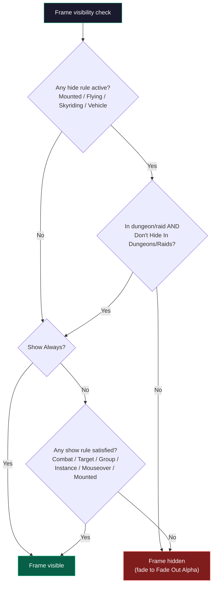

# HUD Visibility

QUI's HUD Visibility system gives you fine-grained control over when your HUD elements appear and disappear. Instead of your frames being permanently visible or manually toggled, you define rules that automatically show and hide them based on your current activity -- in combat, with a target, in a group, or on mouseover.

## Overview

The visibility system applies to six independent frame groups, each with its own set of rules:

- **CDM Visibility** -- Controls the Essential bar, Utility bar, Buff icons, and power bar from the Cooldown Manager.
- **Unit Frames Visibility** -- Controls the Player, Target, Focus, Pet, Target of Target, and Boss unit frames.
- **Custom Trackers Visibility** -- Controls all custom spell and item tracker bars.
- **Aura Displays** -- Controls active Aura Display hosts without revealing displays hidden by their own group, load, unit, or activity rules.
- **Action Bars Visibility** -- Controls QUI-managed action bars.
- **Chat Frames Visibility** -- Controls QUI Chat frames.

Each group uses the same set of visibility rules, but is configured independently. This means you can have your CDM bars appear in combat while your unit frames are always visible, or any other combination that suits your playstyle.

## How to Enable

Visibility rules are configured in the QUI options panel:

- Open `/qui` and go to **Appearance > HUD Visibility**.
- Configure CDM, Unit Frames, Custom Trackers, Aura Displays, Action Bars, and Chat Frames from there.

## Key Features

- **Six independent rule groups** -- CDM, Unit Frames, Custom Trackers, Aura Displays, Action Bars, and Chat Frames each have their own visibility configuration.
- **Combinable show rules** -- Enable multiple show conditions simultaneously. The frame appears if any enabled show rule is satisfied (logical OR).
- **Hide overrides** -- Mounted, vehicle, flying, and skyriding states can forcibly hide frames even when a show rule is active.
- **Dungeon/raid exception** -- A "Don't Hide In Dungeons/Raids" toggle overrides the location hide rules when you are inside instanced content.
- **Fade animation** -- Frames fade in and out smoothly with configurable fade duration instead of snapping on and off.
- **Fade-out alpha** -- Set the minimum alpha when frames are hidden. A value of 0 makes them fully invisible; a higher value keeps them faintly visible as a reminder.
- **Mouseover reveal** -- When enabled, moving your cursor over the frame area brings frames to full visibility regardless of other hide rules.
- **Castbar exception** -- For Unit Frames, an option to always show castbars even when the unit frame itself is hidden, so you never miss a cast.
- **Vehicle hide** -- Every group except Unit Frames can hide while you are in a vehicle.
- **Show below 100% health (Unit Frames only)** -- Show unit frames when the player's health drops below 100%, useful for keeping frames hidden during full health but visible when taking damage.

## Visibility Rules Reference

The shared controls include the following rules; group-specific exceptions are noted:

| Rule | Behavior | Default |
|:-----|:---------|:--------|
| Show Always | Frame is eligible to show unless a hide rule applies | Enabled |
| Show When Target Exists | Frame appears when you have a target selected | Disabled |
| Show In Combat | Frame appears when you enter combat | Disabled |
| Show In Group | Frame appears when you are in a party or raid | Disabled |
| Show In Instance | Frame appears when you are inside a dungeon or raid instance | Disabled |
| Show On Mouseover | Frame appears when you hover over its area | Disabled |
| Show When Mounted | Frame appears while you are mounted | Disabled |
| Fade Duration | Duration of the fade in/out animation in seconds | 0.2 |
| Fade Out Alpha | Minimum opacity when hidden (0 = fully invisible) | 0 |
| Hide When Mounted | Hide the frame when mounted on the ground | Varies by group |
| Hide When In Vehicle | Hide the frame when in a vehicle (not applied to Unit Frames) | Varies by group |
| Hide When Flying | Hide the frame when flying (non-skyriding) | Varies by group |
| Hide When Skyriding | Hide the frame when skyriding | Varies by group |
| Don't Hide In Dungeons/Raids | Override location hide rules inside instances | Varies by group |

## How Rules Interact

Hide rules are checked before ordinary show rules. If a hide rule is active, the frame stays hidden unless "Don't Hide In Dungeons/Raids" suppresses that rule inside instanced content. Otherwise, Show Always or any satisfied show rule makes the frame visible.

If "Show Always" is enabled, no other show rules matter -- the frame is always eligible. Hide rules still apply on top of "Show Always" unless overridden by the dungeon/raid exception.

## Tips

{: .note }
A common setup is to enable "Show In Combat" and "Show When Target Exists" together. This keeps your HUD clean while questing but brings up your frames the moment you engage anything, whether you pull first or get pulled.

{: .important }
The "Fade Out Alpha" setting at 0 makes hidden frames completely invisible. If you are having trouble finding your frames, temporarily set this to 0.3 or higher so you can see where they are, then lower it once positioning is finalized.

{: .note }
The Unit Frames "always show castbars" option is particularly valuable for healers and PvP players who need to see incoming casts even when they have configured their unit frames to hide outside of certain conditions.

{: .note }
"Don't Hide In Dungeons/Raids" is a safety net for niche situations. For example, if you mount up inside a raid (between boss pulls), you probably still want your CDM visible. This toggle prevents mounted-hide from kicking in while you are inside the instance.
